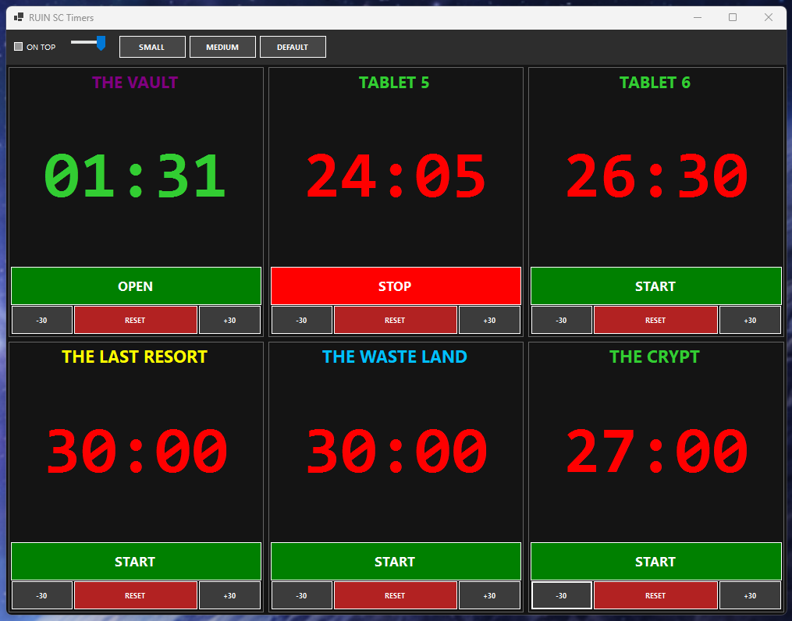

# RUIN SC Timers ⏱️

A lightweight, standalone Windows application designed for tracking Star Citizen (SC) timers. This tool helps you keep track of critical cooldowns and events without needing to tab out of your game.

## 🚀 How to Download & Run

1. Go to the **[Releases](https://github.com/IronThistle/RUIN_SC_Timers/releases)** section on the right.
2. Download the `RUIN_SC_Timers.exe` file.
3. Move the `.exe` to your Desktop.
4. **Double-click to run!** *(Note: If Windows shows a "Protected your PC" popup, click **More Info** -> **Run Anyway**.)*

## ✨ Features
* **Standalone EXE:** No installation required.
* **Single File:** Everything the app needs is packed into one icon.
* **Always on Top:** (If you coded it this way) Perfect for secondary monitors.

## 🛠️ Built With
* C# 
* .NET 8.0 Windows Forms
